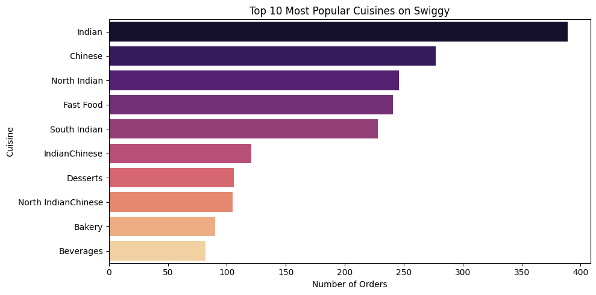
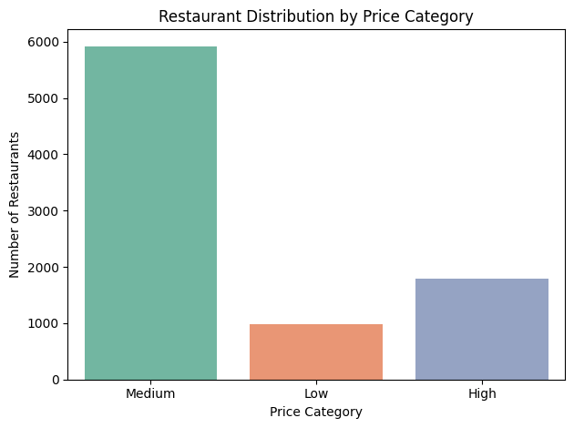
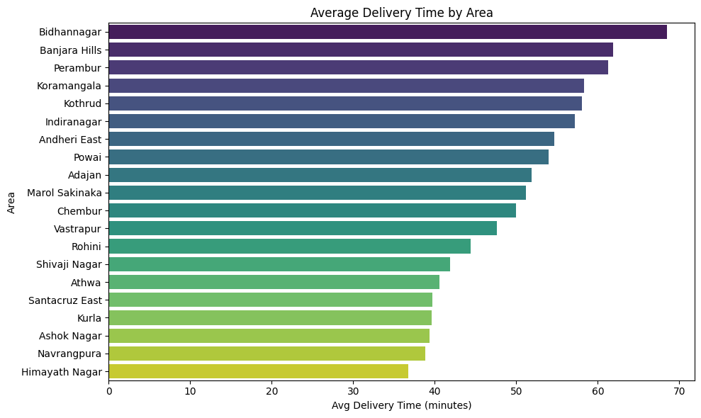
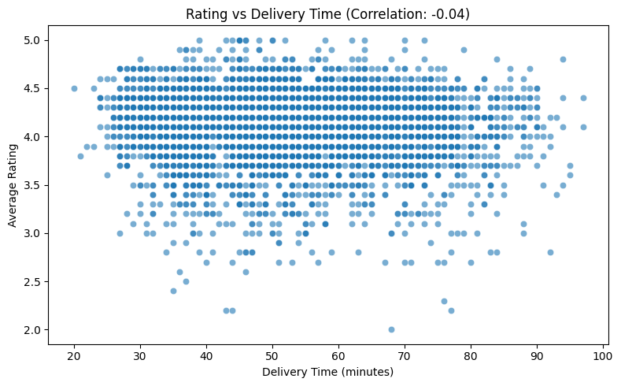
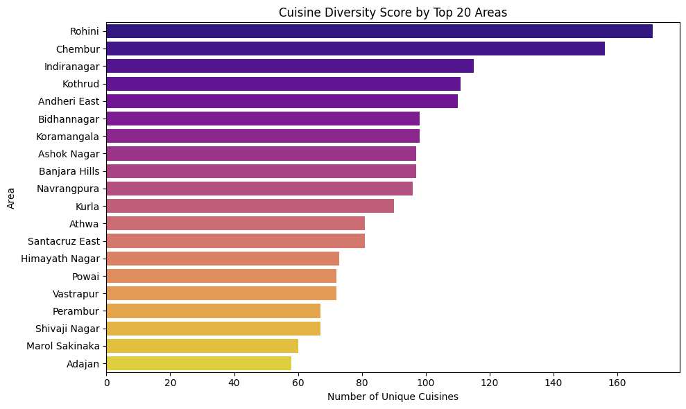
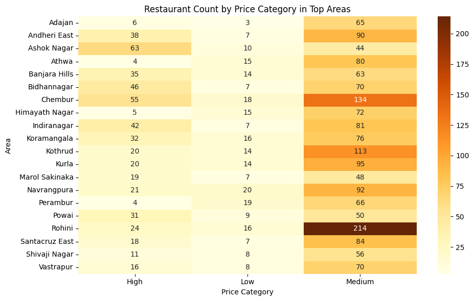
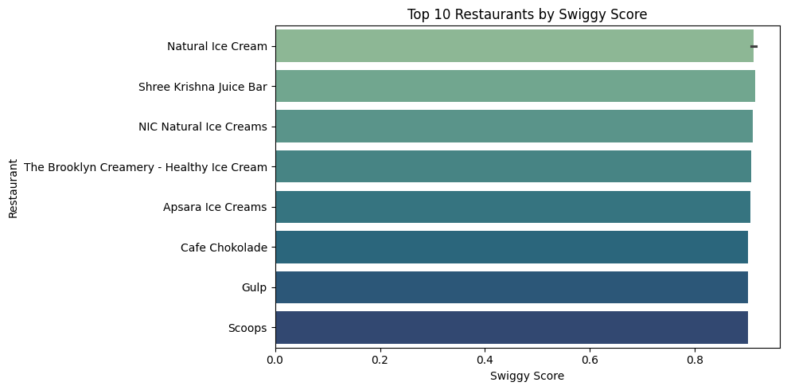

# Swiggy Data Analysis 🛵📊

A complete exploratory data analysis and scoring project on Swiggy restaurant listings. This project goes beyond basic EDA by integrating string parsing, feature engineering, heatmaps, and a custom scoring metric to evaluate restaurant performance using Python.

---

## 🧠 Objective

Analyze Swiggy restaurant data to uncover insights on:

- Cuisine trends by area
- Price vs rating patterns
- Delivery time impact
- Outlier detection
- Restaurant ranking using a composite Swiggy Score

---

## 🛠️ Tech Stack

- Python: pandas, seaborn, matplotlib, scikit-learn
- Jupyter Notebook
- Data Source: Kaggle (Swiggy restaurant listings)
- Outputs: Saved matplotlib plots, CSV exports

---

## 📸 Visual Insights

### 🔥 Top 10 Most Popular Cuisines


---

### 🧾 Restaurant Distribution by Price Category


---

### 🚚 Average Delivery Time by Area


---

### ⭐ Rating vs Delivery Time


---

### 🌐 Cuisine Diversity by Area


---

### 🗺️ Heatmap of Restaurant Types by Area


---

### 💯 Swiggy Score: Custom Ranking System


---

## 🔍 Key Features

- Cleaned and parsed columns like `costForTwoStrings`, `totalRatingsString`, and `cuisines`
- Created price category buckets: Low / Medium / High
- Exploded multi-cuisine fields to evaluate cuisine trends per area
- Correlation analysis between delivery time and rating
- Outlier detection: High-cost, low-rating, slow-delivery restaurants
- Built a custom **Swiggy Score** using:
  - ⭐ Average Rating (50%)
  - 🚚 Inverted Delivery Time (30%)
  - 💸 Inverted Cost (20%)

---

## 📂 Project Structure
```
Swiggy_Project/
├── Swiggy_Analysis.ipynb
├── Swiggy_dataset.csv
├── images/
│ ├── top_cuisines.png
│ ├── price_bucket_distribution.png
│ ├── delivery_time_by_area.png
│ ├── rating_vs_delivery_time.png
│ ├── cuisine_diversity_by_area.png
│ ├── restaurant_price_heatmap.png
│ └── top_swiggy_score.png
├── top_10_swiggy_score.csv
└── README.md
```

---

## ✅ Project Context

This project demonstrates real-world exploratory data analysis, feature engineering, and data storytelling. It reflects end-to-end data handling and insight generation using Python — without relying on external dashboard tools.